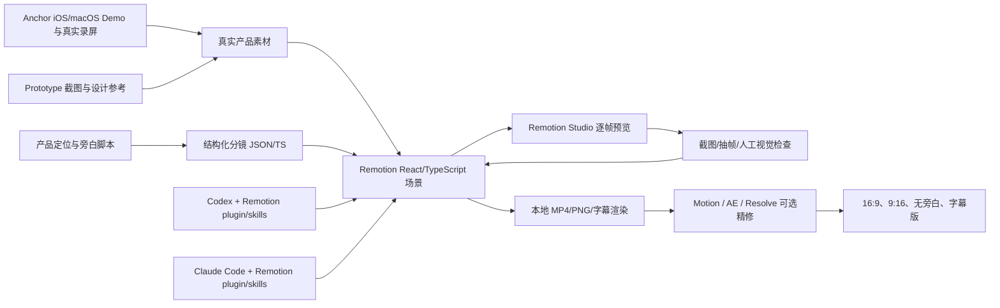

# Anchor 安可产品宣传视频：Codex / Claude Code + Motion Graphics 技术调研与实施方案

更新时间：2026-08-06
适用阶段：Anchor native app 开发完成后的产品宣传视频制作
文档状态：研究版，可直接作为明天的视频开发任务入口

## 一句话结论

Anchor 的第一版参赛宣传片建议采用：

> Remotion 4.x + React/TypeScript + Codex/Claude Code 官方 skills/plugins + 真实 iOS/macOS 录屏 + 最后用 Apple Motion、After Effects 或 DaVinci Resolve 做少量精修。

Remotion 是目前最适合这类工作的主线：它把视频当作 React 组件和时间函数来写，能在本地预览、按帧渲染 MP4，并且官方已经提供面向 Claude Code 和 Codex 的 Agent Skills、Claude Code plugin、Codex plugin。这样既能得到接近 AE 的动效，又能让 Agent 反复修改、渲染、检查和生成 16:9 / 9:16 多个版本。

Apple Motion 和 After Effects 仍然适合做高质量人工 finishing，但不建议把整部片子的核心内容交给 Agent 去直接生成原生工程文件。产品 UI、中文文字、时间线和真实交互应由代码与真实录屏控制；AI 视频生成只作为气氛镜头、抽象 B-roll 或素材变体。

## 1. 先澄清“Motion”可能指什么

这里有三个容易混淆的名字：

1. **Apple Motion**：Apple 的实时 motion graphics 工具，当前官方用户指南列出 Motion 6.3。它适合行为、粒子、3D 相机、光效、标题、转场和 Final Cut Pro 模板。
2. **Motion Canvas**：开源 TypeScript 动画库和编辑器，擅长解释型矢量动画、同步旁白、时间事件和图形演示。
3. **Remotion**：用 React/TypeScript 写可渲染视频的框架。当前官方文档直接把它定位为适合 coding agents、批量渲染和构建视频应用的方案。

如果你看到的是“让 Claude Code/Codex 直接做出产品宣传片”的案例，大概率指的是 **Remotion + Agent Skills**，而不是 Apple Motion 本身。

## 2. 方案调研与取舍

| 方案 | Agent 适配 | 最适合 | 优点 | 主要限制 | 对 Anchor 的判断 |
|---|---|---|---|---|---|
| Remotion + React/TS | 很强；官方支持 Codex、Claude Code、Skills、Plugins | 产品宣传片、App UI 动画、数据驱动视频、多尺寸变体 | 代码是唯一真相；预览快；可组合 SVG、CSS、Canvas、WebGL、图片、视频和音频；可按帧渲染 | 需要自己建立视觉系统；复杂 3D/合成需要额外实现；需确认团队 license | **主路线** |
| Motion Canvas + TypeScript | 中等；可以被通用 coding agent 操作，但目前没有同等成熟的官方 Codex/Claude plugin | 解释型矢量动画、旁白同步、流程演示 | MIT；实时编辑器；生成器函数写时间线；开源 | 官方文档和仓库更新节奏弱于 Remotion；通常先输出图片序列，再交给 FFmpeg 或剪辑软件合成；浏览器文字渲染可能有抖动 | 可做实验或备用，不作为首选 |
| Apple Motion | 弱到中等；Agent 可准备素材、SVG、字幕和脚本，但主要编辑流程仍是 GUI | 手工做粒子、光效、3D 相机、标题和最终润色 | Mac 原生；实时；内置行为、粒子、复制器、3D、模板；做“AE 感”比较直接 | 不是代码优先的可复现工作流；团队协作和自动化不如 Remotion | 作为 finishing 层 |
| After Effects + Expressions/Scripts | 中等到强；Agent 可写表达式、ExtendScript、JSON 数据和渲染脚本 | 最高级 2D 合成、特效、粒子、摄像机、MOGRT | 生态和行业经验最完整；表达式、脚本、`aerender`、MOGRT、数据驱动动画都成熟 | 学习/配置成本高；商业软件；工程文件不适合完全依赖 Agent 自动维护 | 如果时间足够，做最后 10% 的精修 |
| Blender + Python | 强；Python、命令行和无界面渲染适合 Agent | 3D Anchor 图标、设备模型、空间镜头、光照和材质 | 免费；3D 能力最强；可脚本化、后台渲染 | 建模、材质、灯光和渲染成本高；不适合第一天追求全片完成 | 只为 3D hero shot 使用 |
| Runway / Luma 等 AI 视频 | 通过 API 或网页操作 | 抽象背景、海面、粒子、氛围、过场 B-roll | 出素材速度快；图生视频可以生成镜头运动和气氛 | 文字、UI、Logo、产品状态不稳定；版权、授权、可重复性需核查 | 只做辅助素材 |

### 2.1 Remotion：最值得现在投入

Remotion 当前官方路线已经把“视频 + coding agent”作为一等场景：

- 用 `npx create-video@latest` 创建项目。
- 用 `npx remotion skills add` 安装 Agent Skills。
- 在单独终端启动 `npm run dev` 预览。
- 用 `claude` 或 `codex` 进入同一个项目，直接描述要生成或修改的镜头。
- 用 `npx remotion render <composition> <output>` 输出 MP4。
- 官方 Skills 覆盖创建项目、最佳实践、标记、Studio 预览、渲染、字幕、地图、音视频、文档查找和升级。

Remotion 的核心思路是让每一帧都由当前时间决定：

- `useCurrentFrame()` 读取当前帧。
- `interpolate()` 把时间映射为透明度、位置、缩放、旋转、颜色或滤镜强度。
- `spring()` 生成具有弹性、阻尼和惯性的运动。
- `<Sequence>` 把镜头、字幕、音频和组件放到明确的时间段。
- `<OffthreadVideo>` 或当前推荐的媒体组件可以把真实录屏作为可裁剪、可变速、可叠加的素材。

这正好适合 Anchor：把产品截图和录屏当作证据，把 Anchor 的目标、进程、决定、离开、返回这些状态写成镜头组件。

### 2.2 Motion Canvas：为什么不作为首选

Motion Canvas 的定位非常好：TypeScript 生成器函数 + 实时编辑器，专门做 informative vector animations，也支持音频、时间事件和导出图片序列。它是 MIT 开源项目。

但当前仓库页面显示最新 release 为 v3.17.2（2024-12-14），官方文档也明确建议把渲染出的帧序列导入剪辑软件，或用 FFmpeg 转视频；官方代码文档还提示 Chromium 下文字可能抖动，建议使用 Firefox 渲染。

因此它适合：

- 以后做 Anchor 的流程图、网络拓扑、事件流、状态机解释片段。
- 需要精确对齐旁白的矢量解释动画。

它不适合作为本次第一版的唯一底座，因为我们希望明天就让 Codex 和 Claude Code 持续生成、预览、渲染、修正，而且要把真实 App 录屏、字幕、音效和多尺寸输出放在一个工作流里。

### 2.3 Apple Motion：适合做最后的“手感”

Apple 官方将 Motion 描述为可以实时创建复杂图像、电影级标题、流畅转场和真实效果的 motion graphics 工具。当前用户指南包含：

- 2D/3D 图层、摄像机、灯光、阴影、反射和景深。
- Behaviors、Keyframes、粒子系统、Replicators、滤镜和自定义 Rig。
- SVG、PDF、图像序列、音频、视频、USDZ 3D 对象。
- 可以把项目发布成 Final Cut Pro 模板，并暴露可编辑参数。

它非常适合把 Remotion 的最终 MP4 再做一次：光晕、粒子、镜头噪声、轻微景深、光泄漏、Logo 收尾、音效卡点。但官方文档主要描述的是 GUI 时间线和模板工作流，公开资料没有呈现类似 Remotion 的代码优先 Agent pipeline。因此不建议明天先投入大量时间研究如何让 Agent 从零维护 `.motn` 工程。

### 2.4 After Effects：最高上限，但不是最低阻力

After Effects 官方支持：

- Expressions：用 JavaScript 将图层属性绑定到时间、其他图层、数据和控制器。
- Scripts：批量创建图层、替换素材、修改属性和组织工程。
- `aerender`、网络渲染、后处理和自动化渲染。
- JSON、CSV/TSV 数据驱动动画。
- MOGRT/Essential Graphics：把复杂动画包装成带参数的可复用模板。

这条路线能做出最接近传统 AE 专业片的效果，但需要先由人建立工程结构，再让 Agent 写表达式、脚本和素材替换逻辑。对 Anchor 的建议是：如果 Remotion v1 已经完成且还有时间，再把最重要的一个镜头送进 AE/Motion 精修，不要一开始就把整片拆成不可复现的手工时间线。

### 2.5 AI 视频：只把它当素材层

Runway 的官方指南显示，图生视频可以用参考图和文字提示控制镜头运动，适合生成连贯的环境或 B-roll；Luma 的 API 也支持文字生视频、图生视频、起止关键帧、循环和镜头运动。

对 Anchor 应采用以下边界：

- **可以生成**：海面、粒子、柔和光线、抽象数据流、城市/桌面氛围、从静态 Anchor 图标产生的短运动片段。
- **不要生成**：产品 UI、中文按钮、数字、状态标签、Logo 字形、真实进度、真实系统行为。
- AI 素材必须单独记录来源、授权、提示词和生成日期，方便参赛提交或后续发布时核查。

OpenAI Sora 不应作为本片的核心依赖：截至本调研日期，官方已宣布 Sora 网页和 App 于 2026-04-26 停止服务，Sora API 计划于 2026-09-24 停止。即使后续使用其他视频模型，也应把 AI 生成层设计成可替换的素材目录，而不是写死在渲染逻辑里。

## 3. Anchor 的推荐技术架构

### 3.1 目标架构



### 3.2 建议目录

视频工程建议放在 Anchor 仓库里的独立 `video/` 目录，或者单独建一个 `anchor-product-video` 仓库。第一天优先放在独立目录，避免污染 Swift app 的包、Xcode 工程和多人协作改动。

```text
Anchor/
├── Apps/                         # 不由视频 Agent 随意修改
├── Packages/                     # 不由视频 Agent 随意修改
├── Product/Prototype/            # 设计参考和现有截图
├── Documentation/
│   └── ANCHOR_PRODUCT_VIDEO_RESEARCH.md
└── video/                        # Remotion 工程
    ├── package.json
    ├── remotion.config.ts
    ├── src/
    │   ├── Root.tsx
    │   ├── AnchorPromo.tsx
    │   ├── storyboard.ts
    │   ├── scenes/
    │   │   ├── ColdOpen.tsx
    │   │   ├── Problem.tsx
    │   │   ├── AnchorDashboard.tsx
    │   │   ├── Decision.tsx
    │   │   ├── Handoff.tsx
    │   │   ├── Return.tsx
    │   │   └── Closing.tsx
    │   ├── components/
    │   │   ├── DeviceFrame.tsx
    │   │   ├── KineticText.tsx
    │   │   ├── AnchorGlyph.tsx
    │   │   ├── ProcessCard.tsx
    │   │   ├── SceneTransition.tsx
    │   │   └── AudioCue.tsx
    │   ├── theme/
    │   │   └── anchorTheme.ts
    │   └── utils/
    ├── public/
    │   ├── app/                  # 真正的 iOS/macOS 截图和录屏
    │   ├── prototype/            # Product/Prototype 的参考素材
    │   ├── logo/
    │   ├── audio/
    │   ├── captions/
    │   └── ai-broll/             # 可替换的 AI 辅助素材
    ├── scripts/
    │   ├── capture-sim.sh
    │   ├── render.sh
    │   └── extract-review-frames.sh
    └── out/                      # 生成物，不进入源码依赖
```

### 3.3 数据结构先于镜头代码

不要一上来让 Agent 直接写一大段 JSX。先把分镜写成可读、可改、可验证的数据：

```ts
export type Shot = {
  id: string;
  startFrame: number;
  durationInFrames: number;
  purpose: string;
  source: "recording" | "screenshot" | "generated" | "vector";
  narration?: string;
  onScreenText?: string;
  motion: string;
  audioCue?: string;
};
```

这样可以让 Codex 或 Claude Code 做以下工作，而不必每次重写整片：

- 调整一个镜头的时长。
- 批量生成中英文字幕。
- 输出 16:9 和 9:16 两套 composition。
- 替换某个真实录屏而不改动动画逻辑。
- 对每个 shot 做静帧截图和验收。

## 4. Anchor 专用宣传片方向

### 4.1 核心信息

宣传片不应把 Anchor 讲成“又一个任务管理器”，而应把产品价值压缩为：

> 当多个 AI 工作同时推进时，Anchor 保存目标、状态、判断和返回路径，让人离开时不丢失，回来时能继续。

这与现有产品基线一致：目标是 anchor；人类判断是稀缺资源；离开是状态转移；返回是产品时刻；数据优先本地、状态诚实可见。

### 4.2 40 秒第一版分镜草案

以下文案只是可执行草案，开发完成后必须根据真实功能删除尚未实现的承诺。

| 时间 | 画面 | 产品证据 | 动效方向 | 旁白/屏幕文字草案 |
|---|---|---|---|---|
| 0–3s | 黑蓝背景；C/G/S/F 等进程卡片在不同方向漂移，信息越来越多，Anchor glyph 还没有出现 | 多个 AI/创作/终端过程的抽象表示 | 轻微 motion blur、漂移、分层景深；不要做夸张故障特效 | “当几个 AI 工作同时推进，最容易丢掉的是什么？” |
| 3–7s | 卡片同时弹出目标、进度、等待确认、完成等状态，画面短暂失焦 | `Process`、`needsDecision`、`completed` 等真实概念 | 用颜色、纹理和状态标签区分，不依赖单一颜色 | “不是任务本身，而是你为什么开始、下一步要判断什么。” |
| 7–12s | Anchor glyph 从中心出现，卡片被吸附到一个 Anchor Map | Anchor logo / `HarborAnchorGlyph` | 环形轨道、吸附、spring、柔和海浪形遮罩 | “Anchor 安可，把目标和进程固定在一起。” |
| 12–18s | 进入 iPhone portrait dashboard，镜头由全局缩放到当前 Anchor | `01-home-portrait.png` 的布局或 native 录屏 | 设备框架、屏幕内二次缩放、重点卡片高亮 | “你可以一眼看到，正在发生什么，以及哪里需要你。” |
| 18–23s | 决策卡片被拉近，展示一个需要用户选择的任务 | `06-task-decision-portrait.png` / native decision flow | 黄色作为唯一注意力信号；其他内容降亮度 | “真正需要你做决定的，只留下一个清晰入口。” |
| 23–28s | iPhone 和 Mac / landscape workspace 并列，状态线连接两端 | `27-home-landscape.png`、`28-away-landscape.png` 或 native macOS | 局部粒子/光线沿连接线移动；不伪造网络速度 | “离开桌面，工作仍然继续。” |
| 28–34s | away 状态，进度使用纹理条，卡片变化以少量 delta 进入 | Away dashboard、source freshness、last observed | 低频、低对比度的 ambient motion；避免像通知瀑布 | “Anchor 记录发生了什么，而不是把你重新拉回噪音里。” |
| 34–39s | return summary，显示“欢迎回来”、变化摘要和下一步按钮 | `29-return-landscape.png` / native return screen | 从 Anchor glyph 展开波纹，再落到 resume action | “回来时，你不用重建上下文，直接回到正确的决定。” |
| 39–43s | Logo、产品名、短 tagline、参赛信息 | 真实 Logo 和版本信息 | 轻微呼吸、光晕、一次干净的落版 | “Anchor 安可。留下工作，回到正确的决定。” |

### 4.3 视觉语言

以当前代码和原型为准，不要把旧的颜色参考表硬编码进视频：

- 使用 `AnchorPalette` 和当前 native/Prototype 截图作为色彩来源。
- 主要基调是纸白/浅灰蓝背景、深海蓝面板、海沫绿状态、珊瑚/紫色来源标识、黄色决策强调。
- 深海蓝用于主叙事、关键面板和最终落版；黄色只用于需要人判断的瞬间。
- 让“海港/锚/波纹”成为一套动效语法：吸附、停泊、离岸、返回，而不是到处堆粒子。
- 录屏中的中文 UI 必须保持真实，Agent 只负责裁剪、缩放、遮罩、镜头和强调。
- 旧原型的视觉截图可用于设计和分镜；最终参赛片应优先使用开发完成后的 native Demo 录屏。

### 4.4 需要准备的真实素材

当前仓库已经有可用于分镜和预演的参考图：

- `Product/Prototype/output/playwright/01-home-portrait.png`
- `Product/Prototype/output/playwright/06-task-decision-portrait.png`
- `Product/Prototype/output/playwright/28-away-landscape.png`
- `Product/Prototype/output/playwright/29-return-landscape.png`
- `Product/Prototype/output/playwright/27-home-landscape.png`
- `Product/Prototype/主视觉设计方案.png`
- `20260806-213506.png` 或 native 版本的 Anchor glyph

开发完成后需要重新捕获：

1. 新建 Anchor / 设置目标。
2. 同时运行多个 process。
3. 触发 needs decision。
4. 记录 anchor note。
5. handoff / away。
6. 让 Demo 产生几项变化。
7. return summary / resume action。
8. 完成并保存 session。

如果使用 iOS Simulator，可以录制 QuickTime movie：

```sh
xcrun simctl io booted recordVideo --codec=h264 ./video/public/media/anchor-ios-demo.mov
```

停止录制时向命令发送 `Ctrl-C`。截图可以使用：

```sh
xcrun simctl io booted screenshot ./video/public/screenshots/anchor-ios-dashboard.png
```

录制时只保留一个 Booted simulator。完成后，在确认安全的情况下运行：

```sh
xcrun simctl shutdown all
```

本机同时运行 Xcode、Simulator、Codex、Claude Code 和视频渲染会明显增加内存压力；如果渲染异常变慢，应先关闭不用的 Simulator/Xcode，检查是否有 stale `lldb-rpc-server`，再检查 `/` 的剩余磁盘空间。不要修改 Clash Verge 或 Shadowrocket 的任何配置来解决视频工具的网络问题。

## 5. Codex 和 Claude Code 的分工

两者都可以完成整个 Remotion 项目；建议把它们当作两个可复核的工作入口，而不是让两个 Agent 同时改同一批文件。

### 5.1 Codex 适合的任务

- 读取 Anchor 的真实 domain model、Demo fixtures 和已有截图，找出可展示的产品状态。
- 检查 Xcode/Simulator 环境并完成真实录屏。
- 创建 Remotion 项目、主题 tokens、镜头组件和渲染脚本。
- 运行 `npm run dev`、渲染 MP4、抽取关键帧、修复构建或渲染错误。
- 在同一工作区内做截图/视频的视觉检查，并保持与现有 `AGENTS.md` 约束一致。

### 5.2 Claude Code 适合的任务

- 在终端中持续维护多文件的 TypeScript/React motion system。
- 把分镜、字幕、音频 cue 和组件规范整理成 project skill。
- 用 subagents 分别做 storyboard review、motion implementation、render QA。
- 用 hooks 在渲染完成后自动执行 `ffprobe`、截图或文件完整性检查。
- 用 `claude -p` 在脚本或 CI 中执行无交互的批量渲染/检查。

Anthropic 当前文档说明：Claude Code 的 skills 通过 `SKILL.md` 扩展能力，subagents 拥有独立上下文和工具权限，hooks 可以在生命周期节点执行 shell 命令、HTTP endpoint 或提示词。对于本项目，这意味着可以把“渲染后校验”写成可复用流程，但不应把允许 Agent 修改 Anchor 主 app 的权限一起开放给视频 skill。

OpenAI 当前 Codex 文档也支持 skills、plugins、MCP、子任务、非交互式 `codex exec` 和本地仓库工作流。Remotion 的官方 Codex plugin 可以在 ChatGPT desktop app 中安装，使用 `$remotion` 触发；Claude Code 则有对应的官方 plugin。

### 5.3 推荐的安全协作方式

1. 先在 `video/` 目录完成视频工程。
2. 视频 Agent 默认只允许修改 `video/`、`Documentation/` 和明确指定的素材目录。
3. `Apps/`、`Packages/`、`Anchor.xcodeproj` 默认只读。
4. 两个 Agent 不要同时编辑同一个 scene 文件；一个负责实现，另一个负责 review/QA。
5. 每次开始前都检查 GitHub 的 main 更新和 open PR；发现更新先同步，再开始修改。
6. 不要因为视频工程需要素材就改变 Clash Verge 或 Shadowrocket 的全局网络配置。

## 6. 明天的实际执行流程

### Phase 0：同步与保护现有工作区（10–15 分钟）

在任何本地代码修改前：

```sh
cd /Users/andywang/Desktop/Anchor
git status --short --branch
git fetch origin
git log --oneline --decorate -3 --all
gh pr list --repo asdfghklddd/Anchor --state open --limit 20
```

本次调研时的检查结果：

- 本地 `HEAD` 与 `origin/main` 都是 `04f19036a97df47719958ce6346b4278531e19ae`。
- 已认证 GitHub CLI 返回没有 open PR。
- 当前工作区有一批未提交的 Anchor native 代码改动；视频工作不能覆盖或格式化这些文件。
- GitHub 网页公开页面返回 404，说明仓库页面不能通过公开网页直接读取；本次判断以远端 ref 和已认证 `gh` 结果为准。

明天仍需重新执行这一步。即使只是继续 `video/`，也建议先完成检查并保留当前 dirty worktree。

### Phase 1：创建视频工程（15–30 分钟）

在仓库根目录执行：

```sh
npx create-video --yes --blank video
cd video
npm install
npx remotion skills add
npm run dev
```

如果使用 Claude Code 官方 plugin：

```sh
claude plugin marketplace add remotion-dev/claude-code-plugin
claude plugin install remotion@remotion
```

安装完成后重启 Claude Code。若使用 Codex desktop app，打开 Remotion plugin，或者在新任务中使用 `$remotion` 触发官方支持。

不要在这一步安装 Superpowers/obra-superpowers 相关任何内容；本方案只使用 Remotion 官方资源、普通 Codex/Claude Code 能力和现有项目工具。

### Phase 2：先做一个 8–12 秒的 hero proof（1–2 小时）

第一目标不是完成 40 秒整片，而是完成一个能判断方向的高质量短片：

1. 深海蓝背景和 Anchor glyph。
2. 四个 process cards 从漂移到吸附。
3. 镜头进入真实 dashboard 截图/录屏。
4. decision card 以黄色被聚焦。
5. 以一个干净的 Anchor logo 结束。

只有这个 hero proof 的动效、字体、阴影、色彩和节奏成立，才继续扩展 away/return/closing。

### Phase 3：建立 Motion Design System（1–2 小时）

先实现可复用组件：

- `AnchorTheme`：颜色、字体、圆角、阴影、背景纹理、frame rate。
- `DeviceFrame`：iPhone portrait、iPhone landscape、Mac window、纯屏幕 crop。
- `KineticText`：标题、标签、数字、逐字字幕、强调词。
- `ProcessCard`：对应真实 source tone，支持 running/decision/away/completed。
- `AnchorGlyph`：用 SVG/Canvas 重画当前 `HarborAnchorGlyph`，不要让 AI 改 Logo 形状。
- `SceneTransition`：吸附、波纹、遮罩、镜头推进、淡出。
- `AudioCue`：转场、确认、完成、返回四类短音效。

所有运动由 frame 驱动，不使用 CSS `animation`、`setInterval`、`Date.now()` 或无法在渲染时复现的随机数。随机粒子必须使用固定 seed。

### Phase 4：扩展到完整 40 秒（2–4 小时）

按“问题 → 固定 → 离开 → 返回 → 继续”的叙事顺序接入真实画面。每完成一个 scene，就先渲染 3–5 秒局部，不要等整片结束才发现时间线或素材路径有问题。

### Phase 5：声音和字幕（1–2 小时）

- 先根据旁白节奏锁定镜头，再选音乐，不要先用音乐绑死画面。
- 优先使用有明确授权的音乐和音效，或自己制作简单低频/海港质感的 sound bed。
- 旁白可先用真人录音做 timing，之后再决定是否换 TTS。
- 中文字幕应由结构化脚本生成，避免 Agent 手工复制文字造成错字。
- 保留无旁白版和烧录字幕版；比赛现场可能需要静音播放。

Remotion 当前文档提供字幕导入、转录、显示和导出流程，也提供本地/渲染期音频控制。最终中文字体必须随工程固定，不依赖某台机器偶然安装的字体。

### Phase 6：渲染与检查（30–60 分钟）

开发预览：

```sh
npm run dev
```

渲染：

```sh
npx remotion render AnchorPromo out/anchor-promo-16x9.mp4
```

建议同时输出：

- `anchor-promo-16x9.mp4`：1920×1080，比赛主版本。
- `anchor-promo-9x16.mp4`：1080×1920，社交媒体/展示屏竖版。
- `anchor-promo-muted.mp4`：无旁白或弱音乐版本。
- `anchor-promo-subtitled.mp4`：烧录中文字幕版本。
- `review-frames/`：每个 shot 的首帧、中帧、尾帧。

如果安装了 FFmpeg/ffprobe，可检查：

```sh
ffprobe -v error -select_streams v:0 \
  -show_entries stream=width,height,r_frame_rate,codec_name \
  -show_entries format=duration \
  -of default=noprint_wrappers=1 out/anchor-promo-16x9.mp4
```

检查项目：

- 所有文字在手机和比赛投影尺寸下可读。
- 关键 UI 来自真实 Anchor，不是 AI 猜出来的界面。
- 没有字体替换、中文断行、Logo 变形、数字跳动、黑帧、闪烁或音画不同步。
- 16:9 与 9:16 不是简单裁剪；重要文字和设备画面应有各自的构图。
- 旁白峰值、音乐底噪和转场音效不会互相遮盖。
- 输出视频中的产品承诺都能在当前 build 中被演示或明确标注为未来能力。

## 7. 可直接给 Agent 的启动提示词

### 7.1 Codex 第一轮提示词

```text
我们要为 Anchor 安可制作参赛产品宣传视频。先不要修改 Apps/、Packages/ 或 Anchor.xcodeproj。

请先完成只读检查：
1. git status --short --branch
2. git fetch origin
3. 对比 HEAD、origin/main，并检查 open PR
4. 阅读 README.md、Documentation/PRODUCT_BASELINE.md、当前 AnchorPalette.swift、AnchorDemoSupport 和 Product/Prototype/output/playwright/ 的参考图

然后只在 `video/` 目录建立 Remotion + React + TypeScript 工程：
- 先做 8–12 秒 hero proof，不要直接写完整 40 秒
- 使用 Anchor 的真实颜色、Anchor glyph、process card、needs decision、away、return 语义
- 所有动画必须由 useCurrentFrame/interpolate/spring/Sequence 驱动
- 不使用 CSS animation、setInterval、Date.now() 或未固定 seed 的随机数
- 先创建 storyboard.ts、AnchorTheme、DeviceFrame、KineticText、ProcessCard、AnchorGlyph
- 使用现有 prototype 截图作为临时素材，但在文档中标记为 prototype reference
- 每完成一个关键步骤都运行预览或局部渲染，并报告输出文件路径
- 不改变 Clash Verge、Shadowrocket 或任何全局网络配置
```

### 7.2 Claude Code 第一轮提示词

```text
我们要为 Anchor 安可制作 40 秒产品宣传片。请先用 plan mode，只读检查仓库和当前工作区，确认不要触碰 Apps/、Packages/、Anchor.xcodeproj，也不要修改任何 VPN 配置。

请阅读：
- Documentation/PRODUCT_BASELINE.md
- README.md
- Packages/AnchorKit/Sources/AnchorDesign/AnchorPalette.swift
- Packages/AnchorKit/Sources/AnchorDesign/HarborAnchorGlyph.swift
- Product/Prototype/output/playwright/ 的 home、decision、away、return 截图
- Documentation/ANCHOR_PRODUCT_VIDEO_RESEARCH.md

目标：在 `video/` 建立 Remotion 项目，先完成 8–12 秒 hero proof：多个 process cards 漂移 → 吸附到 Anchor → 进入真实 dashboard → 黄色 decision card 聚焦 → Logo 收尾。

请按顺序：
1. 提出最小文件结构和风险
2. 等我确认后创建工程
3. 安装/使用 Remotion best-practices、markup、studio、render skills
4. 每次只实现一个可渲染的 scene
5. 运行渲染和静帧检查，报告具体文件

如果需要并行工作，使用只读或隔离的 subagent 做 storyboard review 和 render QA；不要让多个 agent 同时编辑同一个 scene 文件。
```

## 8. 质量、版权与协作风险

### 8.1 Remotion license

Remotion 当前官网显示：个人和不超过 3 人的公司/团队可使用 Free License，页面标注可商业使用；4 人及以上的协作/公司项目进入 Company License 规则，并有按用量或 seat 的付费方案。Anchor 是参赛项目，明天创建工程时要根据实际参赛团队人数、组织归属和是否公开发布再确认一次，不要只看“开源”三个字就默认所有场景都免费。

### 8.2 AI 生成素材

- 不要把未经核查的第三方 Logo、字体、音乐、角色或影视风格放入成片。
- 不要把未授权的真人声音或肖像用于旁白/镜头。
- AI 生成的 B-roll 保存原始文件和提示词。
- 产品截图、用户数据、终端内容先脱敏；尽量使用 Demo fixture。

### 8.3 真实产品与宣传承诺

视频中每个“已完成”“已同步”“本地优先”“离开后仍继续”等句子，都要回到当前 build 验证。对于还在后续阶段的 CloudKit、真实 AI source adapter、Safari extension 或 CLI 集成，不要用画面暗示已经全部存在。

### 8.4 性能与内存

Remotion、Chromium、FFmpeg、Xcode 和 Simulator 同时运行时，渲染可能触发较高内存压力。遇到异常时按本机习惯处理：只保留一个 Booted simulator，先 `xcrun simctl shutdown all`，再检查 stale `lldb-rpc-server`、退出无用的 Xcode/Simulator，最后检查磁盘空间。不要为了网络或代理问题修改 Clash Verge、Shadowrocket 或 Codex 本体连接配置。

## 9. 第一阶段完成标准

明天第一轮不以“完整成片”作为唯一目标，而以以下结果作为通过条件：

- `video/` 独立工程能启动 Remotion Studio。
- Codex 或 Claude Code 能在不修改 Anchor native app 的情况下生成/修改场景。
- 8–12 秒 hero proof 能稳定渲染成 MP4。
- 真实 Anchor UI、Anchor glyph 和当前视觉 tokens 已被正确使用。
- 关键动画在任意帧可复现，没有时间函数、随机数或浏览器动画导致的渲染差异。
- 已有一版 40 秒分镜、旁白草稿、素材清单和待验证产品承诺。
- 明确下一轮是继续纯 Remotion，还是把一个 hero shot 送入 Motion/AE 精修。

## 10. 调研来源

### 官方视频与动效工具

- [Remotion 首页](https://www.remotion.dev/)
- [Remotion：Prompting videos with coding agents](https://www.remotion.dev/docs/ai/coding-agents)
- [Remotion Agent Skills](https://www.remotion.dev/docs/ai/skills)
- [Remotion Codex plugin](https://www.remotion.dev/docs/ai/codex-plugin)
- [Remotion Claude Code plugin](https://www.remotion.dev/docs/ai/claude-code-plugin)
- [Remotion Prompt Showcase](https://www.remotion.dev/prompts)
- [Remotion 渲染](https://www.remotion.dev/docs/render)
- [Remotion `<OffthreadVideo>`](https://www.remotion.dev/docs/offthreadvideo)
- [Motion Canvas Introduction](https://motioncanvas.io/docs/)
- [Motion Canvas Rendering](https://motioncanvas.io/docs/rendering/)
- [Motion Canvas GitHub](https://github.com/motion-canvas/motion-canvas)
- [Apple Motion User Guide](https://support.apple.com/guide/motion/welcome/mac)
- [Adobe After Effects Automation](https://helpx.adobe.com/after-effects/using/automation.html)
- [Adobe After Effects Motion Graphics Templates](https://helpx.adobe.com/after-effects/desktop/motion-graphics/work-with-motion-graphics-templates/creating-motion-graphics-templates.html)
- [Adobe After Effects Expressions](https://helpx.adobe.com/after-effects/using/expression-language-reference.html)
- [Blender Command Line Rendering](https://docs.blender.org/manual/en/latest/advanced/command_line/render.html)

### Agent 官方文档

- [OpenAI Codex CLI](https://developers.openai.com/codex/cli)
- [OpenAI Skills & Plugins](https://learn.chatgpt.com/docs/skills-and-plugins)
- [Anthropic Claude Code Setup](https://docs.anthropic.com/en/docs/claude-code/getting-started)
- [Claude Code Skills](https://code.claude.com/docs/en/skills)
- [Claude Code Subagents](https://code.claude.com/docs/en/sub-agents)
- [Claude Code Hooks](https://code.claude.com/docs/en/hooks)
- [Claude Code MCP](https://code.claude.com/docs/en/mcp)

### AI 视频素材与当前服务状态

- [Runway：Creating with Gen-4 Video](https://help.runwayml.com/hc/en-us/articles/37327109429011-Creating-with-Gen-4-Video)
- [Luma：Video Generation API](https://docs.lumalabs.ai/ue/docs/video-generation)
- [OpenAI：Sora discontinuation notice](https://help.openai.com/en/articles/20001152-what-to-know-about-the-sora-discontinuation)
