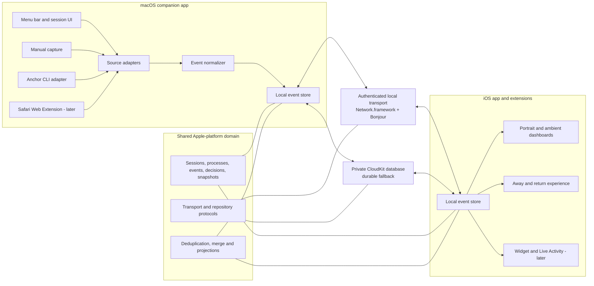

# Anchor native development blueprint

Status: native frontends and minimum local-link foundation implemented, version
0.3, 2026-08-05. The iPhone app, macOS menu bar/detail app, isolated Demo apps,
shared reducers, conservative presence state machine, authenticated Bonjour/BLE
link, bilingual resources, accessibility adaptations, and CI archive boundary
are in place. SwiftData, CloudKit, offline merge, CLI/Safari adapters, and
production source integrations remain planned follow-up phases.

This document turns the product baseline into a buildable iOS and macOS system.
It intentionally starts with one thin, trustworthy end-to-end path and leaves
broad automation until the event model, sync behavior, and privacy boundaries are
proven.

## Architectural position

Anchor should be:

- Native SwiftUI on iOS and macOS.
- Local-first and usable when CloudKit or the local network is unavailable.
- Event-driven so state can be reconstructed, merged, audited, and summarized.
- Adapter-based so each external source has a narrow, testable permission scope.
- Explicit about freshness, confidence, source, and failure.
- Dependency-light: use Apple frameworks first and add third-party packages only
  after a written decision.

## Platform topology



CloudKit is durable synchronization, not a hard real-time bus. Apple describes
Core Data/CloudKit propagation as occurring on a natural cadence and generally
within about a minute. A foreground desk-companion experience therefore needs a
same-network transport, while CloudKit remains the offline and away fallback.

## Xcode target structure

The repository now has independent app lifecycles, entitlements, permissions,
and release boundaries. Production targets share `com.andywang.anchor` for
universal purchase; Demo targets use `com.andywang.anchor.demo` and are the only
apps that link `AnchorDemoSupport`.

Current targets and shared package modules:

```text
Anchor.xcodeproj
├── Anchor iOS                 production iPhone application
├── Anchor iOS Demo            persisted fixtures and scenario controls
├── Anchor macOS               production menu bar and detail window
├── Anchor macOS Demo          desktop fixtures and scenario controls
├── AnchorIOSUITests
└── AnchorMacUITests
Packages/AnchorKit
├── AnchorCore                 domain, commands, projections and presence reducer
├── AnchorDesign               semantic tokens, shared controls and localization
├── AnchorDemoSupport          fixtures, mock repository and Demo-only controls
├── AnchorIOSFeatures          native iPhone feature UI
├── AnchorMacFeatures          native macOS feature UI
└── AnchorTransport            Bonjour, Keychain trust, encrypted events and BLE RSSI
```

The package boundaries keep production UI independent of fixtures and allow
reducers, persistence behavior, and transport framing to run without a simulator.
Widgets, Live Activities, Safari integration, and a signed CLI remain later
targets rather than empty scaffolds.

Feature folders inside each app target should follow user capabilities rather
than generic technical layers:

```text
Features/
├── SessionSetup/
├── Dashboard/
├── ProcessDetail/
├── Decision/
├── AnchorCapture/
├── Handoff/
├── Return/
├── History/
├── Sources/
└── Settings/
```

## Domain model

Use stable UUIDs generated by the originating device. Store dates as absolute
timestamps and derive localized strings only in the view layer.

### `AnchorSession`

- `id`, `goal`, `status`, `presence`
- `startedAt`, optional `completedAt`
- processes, decisions, notes, snapshots, timeline, and processed event IDs

### `AnchorProcess`

- `id`, `sessionID`, `sourceID`, optional `externalID`
- `title`, optional `detail`, `status`
- optional `progress`, `metricValue`, `metricLabel`, `estimatedCompletion`
- `lastObservedAt`, `freshness`, optional `deepLink`

### `ProcessEvent`

- `id`, `sessionID`, `processID`, `sourceID`
- `observedAt`, `receivedAt`, `kind`, `summary`
- optional progress, metric, detail, and deep link
- optional `deduplicationKey` supplied by the adapter
- `schemaVersion`

Events are append-only. Corrections are new events that supersede an earlier
event; history is not silently rewritten.

### `Decision`

- `id`, `processID`, `createdByEventID`
- prompt, ordered options, status, priority, expiry
- optional resolution, resolving device, and resolved timestamp

### `AnchorNote`

- `id`, `sessionID`, body, origin surface, created timestamp
- optional references to a process or decision

### `ContextSnapshot`

- `id`, `sessionID`, trigger, generated timestamp
- goal summary, process projection, open decisions, recommended resume item
- source event watermark used to generate the snapshot

### `PresenceEvent` and `SourceConnection`

Presence records detection source, confidence, user override, and timestamp.
Source connection records permission scope, health, last successful event, and
whether content is stored locally or synchronized.

## External event contract

All adapters normalize input into one versioned envelope before it reaches the
store. The first CLI and simulator should use the same contract as later browser
or API adapters.

```json
{
  "id": "uuid",
  "sessionID": "uuid",
  "sourceID": "uuid",
  "sequence": 42,
  "timestamp": "2026-08-04T13:41:00Z",
  "type": "process.progress.v1",
  "payload": "base64-encoded typed payload"
}
```

Rules:

- `eventID` or an adapter-scoped deduplication key makes retries idempotent.
- Progress is `0...1` or absent; unknown progress is never represented as zero.
- The envelope contains a concise summary, not raw prompts, documents, tokens, or
  model output unless the user explicitly chooses to attach them.
- Unknown fields are ignored for forward compatibility; unsupported schema
  versions are quarantined and surfaced as source errors.
- A decision is created from an event, not inferred in the view layer.

## Persistence and synchronization

### Local store

Use SwiftData with a schema designed for CloudKit from the first migration:

- Avoid `@Attribute(.unique)`; enforce uniqueness and event deduplication in the
  repository actor.
- Give persisted properties defaults or make them optional.
- Make CloudKit-synchronized relationships optional and define inverses.
- Isolate persistence and event reduction in a `@ModelActor` repository.
- Keep immutable transport DTOs separate from persisted models and UI projections.
- Add an explicit `SchemaMigrationPlan` before the first external beta.

If early load, migration, or CloudKit reliability tests reveal a blocker, the
repository protocol allows a switch to `NSPersistentCloudKitContainer` without
rewriting views or source adapters.

### Two transports

1. **Local real-time path**
   - macOS advertises a narrow Bonjour service.
   - iOS discovers it with Network.framework after a contextual local-network
     permission explanation.
   - Pairing uses a one-time code or QR-derived secret; all frames are authenticated
     and replay-protected.
   - The channel sends event envelopes and acknowledgements, not database files.

2. **Cloud durable path**
   - Both apps use the same private CloudKit container.
   - Cloud sync carries sessions, events, decisions, notes, and snapshots when the
     devices are separated or one app is suspended.
   - UI shows a local, cloud, stale, or disconnected freshness state.
   - CloudKit delivery order is not assumed. Merge is deterministic after restart
     and after arbitrary event ordering.

### Merge policy

- Immutable events merge by ID and deduplication key.
- Process state is a deterministic projection over ordered events; ties use event
  ID after timestamp and source priority.
- Decision resolution is first-valid-resolution-wins unless the source explicitly
  supports revision; later conflicts are preserved for audit and shown to the user.
- Editable session metadata uses revision plus `lastModifiedAt`; conflicts keep the
  losing value in a short audit entry rather than silently discarding it.
- Deletion is a tombstone event so another offline device cannot resurrect data.

## macOS companion architecture

The Mac product is a normal signed app, preferably with `MenuBarExtra`, plus a
settings or session window. It may offer launch-at-login through `SMAppService`,
which is user-controlled in System Settings.

Source adapters implement one interface:

```swift
protocol ProcessSource: Sendable {
    var descriptor: SourceDescriptor { get }
    func events() -> AsyncThrowingStream<ExternalProcessEvent, Error>
    func perform(_ action: SourceAction) async throws -> SourceActionReceipt
}
```

Start with:

1. A deterministic simulator for product and UI development.
2. Manual process and event capture in the Mac app.
3. A signed `anchor` CLI or authenticated local IPC endpoint that scripts can call.

Then add source-specific adapters. The UserNotifications API returns notifications
delivered by the current app; it is not a public mechanism for reading every other
app’s Notification Center entries. Anchor must not base its architecture on that
assumption. Broad Accessibility or Screen Recording access is also excluded from
the MVP and would require a separate permission, privacy, and App Review decision.

A Safari Web Extension is viable later. It runs in separate sandboxed components,
uses explicit site permissions, and communicates with its containing app through
native messaging and an App Group. Chrome/Edge support is a separate package even
if much of the web-extension code is shared.

## iOS architecture

- Use `NavigationStack` with typed routes and one registration per destination
  type. Use `sheet(item:)` for optional process or decision presentations.
- Own app-level observable state in `@MainActor @Observable` types. Views keep only
  private, local presentation state.
- Persistence, transport, summary generation, and source actions run in actors and
  expose async sequences or immutable projections to the main actor.
- Portrait and landscape views share the same `SessionProjection`; landscape is a
  distinct composition, not a second task model.
- Use semantic Dynamic Type styles, SF Symbols or accessible custom assets, and
  labels that combine source, status, metric, freshness, and action.
- Respect Reduce Motion and Differentiate Without Color from the first component.

Live Activities and widgets are projections, never the source of truth. ActivityKit
data is size-limited and Live Activities have system lifecycle limits, so they
should show the top decision and compact session status rather than the full event
history. StandBy appearance is system-controlled; Anchor can provide a suitable
Live Activity or widget but cannot force the phone into StandBy.

## Privacy and security baseline

- Data is personal and stored locally plus the user’s private CloudKit database by
  default.
- Every source declares what it reads, what it stores, and which actions it can
  perform. Read and action permissions are separate.
- Secrets, pairing keys, and source credentials use Keychain, never SwiftData,
  `UserDefaults`, logs, fixtures, or Git.
- Logs contain identifiers and state transitions, not raw prompts or generated
  content. Diagnostic export is explicit and redactable.
- Notification previews default to the least sensitive useful summary.
- Local-network, speech, notification, launch-at-login, browser-site, and any future
  Accessibility permissions are requested only when their feature is activated.
- Pairing can be revoked from either device, rotates credentials, and rejects replay.
- No source action is executed twice after retry; action receipts are idempotent.

## Concurrency and state management

- Swift 6.2 strict concurrency is the target.
- `@MainActor @Observable` presentation models coordinate screens and user actions.
- A `@ModelActor` owns persistence and event reduction.
- A separate transport actor owns local connections, reconnection backoff, and
  acknowledgements.
- Each source adapter owns its mutable state in an actor.
- Use structured tasks and `AsyncSequence`; avoid detached tasks and ad-hoc global
  dispatch queues.
- Cancellation is part of every long-running source, sync, and screen task.

## Testing strategy

### Unit tests

- Session, presence, process, and decision state transitions.
- Event decoding, schema compatibility, deduplication, ordering, and projection.
- Merge behavior under duplicate, delayed, reordered, and conflicting events.
- Return-summary selection and resume recommendations.
- Privacy redaction and notification content policy.
- Every source adapter against recorded, sanitized fixtures.

### Integration tests

- Local pairing, reconnect, acknowledgement, and replay rejection.
- Offline edits on both devices followed by deterministic reconciliation.
- CloudKit development-container synchronization with two test identities/devices.
- Store migration and recovery from interrupted writes.
- CLI-to-Mac-to-iPhone and decision-resolution round trips.

### UI and accessibility tests

- Setup, active, decision, handoff, away, return, and completion golden paths.
- Error, empty, permission-denied, stale, and disconnected states.
- Portrait, landscape, small iPhone, and accessibility text sizes.
- VoiceOver order and labels, keyboard navigation on Mac, Reduce Motion, increased
  contrast, and Differentiate Without Color.

UI tests cover critical journeys; business rules remain unit-tested outside views.

## Delivery sequence

### Phase 0 - foundation

- Confirm deployment targets, bundle/App Store strategy, and CloudKit container.
- Split the iOS and macOS targets and introduce the shared domain target.
- Add CI builds for iOS Simulator and macOS plus unit tests.
- Implement models, migrations, repository protocols, fixtures, and semantic design
  tokens.

### Phase 1 - thin vertical slice

- Create and persist an anchor session and manual processes.
- Render native portrait dashboard and process detail from a fixture event stream.
- Build the Mac menu bar shell and deterministic simulator source.
- Send one event over the authenticated local channel and project it on iPhone.
- Resolve one decision on iPhone and acknowledge it on Mac.

This phase proves the architecture before reproducing every prototype screen.

### Phase 2 - durable sync and CLI

- Enable the private CloudKit store and background remote notifications.
- Implement deterministic merge and freshness UI.
- Add the supported CLI event contract and source-health diagnostics.
- Validate offline, restart, duplicate, reordering, and reconnect scenarios.

### Phase 3 - handoff and return

- Add explicit handoff first, then conservative automatic presence suggestions.
- Generate context snapshots and return summaries from event history.
- Add quiet notification policy for decision, failure, and meaningful completion.

### Phase 4 - product depth

- Complete portrait and landscape ambient dashboards.
- Add history, session completion, source settings, and privacy controls.
- Add widgets and Live Activity after the session projection is stable.

### Phase 5 - source expansion

- Ship the Safari Web Extension with narrow site permissions.
- Add the first two source-specific integrations chosen from user research.
- Evaluate whether an optional Anchor cloud service is justified by latency,
  cross-platform, or collaboration requirements.

### Phase 6 - beta hardening

- Migration, corruption, performance, energy, accessibility, privacy, and App
  Review audits.
- TestFlight and notarized Mac beta telemetry limited to explicit diagnostics.
- Lock the production CloudKit schema and release checklist.

## Next implementation backlog

The native UI, Demo boundary, reducers, presence flow, and minimum local-link code
are complete. Continue in this order:

1. Validate Bonjour pairing, encrypted event acknowledgement, BLE RSSI, dictation,
   rotation, haptics, and VoiceOver on a physical iPhone and Mac.
2. Introduce the SwiftData schema, repository actor, and migration harness behind
   the existing `SessionRepository` protocol.
3. Make event projection deterministic under duplicate, delayed, reordered, and
   conflicting events, then add offline restart tests.
4. Enable the private CloudKit store and surface local/cloud freshness without
   treating CloudKit as a real-time bus.
5. Add the signed CLI contract and manual Mac event capture.
6. Add production source adapters only after their permission and privacy scopes
   are documented and tested.
7. Add widgets, Live Activities, and Safari integration after the persistence and
   merge contracts are stable.

## Definition of done for every feature

- Product outcome and failure states are documented.
- Domain logic is tested independently of SwiftUI.
- iOS and Mac builds pass with strict concurrency warnings treated as errors.
- Offline, restart, duplicate-event, and permission-denied behavior is defined.
- VoiceOver, Dynamic Type, Reduce Motion, keyboard access where applicable, and
  color-independent status are verified.
- User-facing errors explain what happened and offer a next action.
- Logging contains no sensitive content or credentials.
- Documentation and fixtures are updated with the code.

## Official platform references

- [SwiftData model configuration and CloudKit options](https://developer.apple.com/documentation/swiftdata/modelconfiguration)
- [Syncing SwiftData model data across a person’s devices](https://developer.apple.com/documentation/swiftdata/syncing-model-data-across-a-persons-devices)
- [CloudKit architecture choices](https://developer.apple.com/documentation/cloudkit/deciding-whether-cloudkit-is-right-for-your-app)
- [Core Data/CloudKit synchronization cadence](https://developer.apple.com/documentation/coredata/syncing-a-core-data-store-with-cloudkit)
- [Network.framework service discovery with `NWBrowser`](https://developer.apple.com/documentation/network/nwbrowser)
- [Local network privacy requirements](https://developer.apple.com/documentation/technotes/tn3179-understanding-local-network-privacy)
- [macOS login items and helpers with `SMAppService`](https://developer.apple.com/documentation/servicemanagement/smappservice)
- [Notifications delivered by the current app](https://developer.apple.com/documentation/usernotifications/unusernotificationcenter/getdeliverednotifications%28completionhandler%3A%29)
- [Safari Web Extension native messaging and App Groups](https://developer.apple.com/documentation/safariservices/messaging-between-the-app-and-javascript-in-a-safari-web-extension)
- [Live Activities](https://developer.apple.com/documentation/activitykit/displaying-live-data-with-live-activities)
- [Widget and Live Activity interactions](https://developer.apple.com/documentation/widgetkit/adding-interactivity-to-widgets-and-live-activities)
