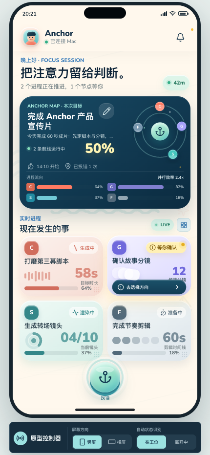

# Anchor

Anchor is a native iPhone and macOS attention companion for people coordinating
several AI-assisted processes at once. It preserves the goal, live process state,
human decisions, and the context needed to return after an interruption.



## Current implementation

- Dedicated iOS and macOS production apps with the shared bundle identifier
  `com.andywang.anchor` for universal purchase.
- `AnchorCore`: immutable projections, typed commands, reducers, repository
  contracts, presence inference, return summaries, and event deduplication.
- `AnchorDesign`: adaptive Candy Harbor semantic colors, accessible shared
  components, and a complete English/Simplified Chinese String Catalog.
- `AnchorIOSFeatures`: setup, portrait dashboard, landscape Ambient workspace,
  decisions, anchor notes, handoff/away/return, history, management, and settings.
- `AnchorMacFeatures`: menu bar status plus a native detail window using
  `NavigationSplitView`.
- `AnchorTransport`: Bonjour discovery, one-time-code key agreement, Keychain
  trust, authenticated event envelopes and acknowledgements, BLE RSSI proximity
  advertising/scanning, and an optional CloudKit private event store.
- `AnchorCore`: a versioned external source contract, actor-based source
  ingestion, a durable CLI inbox, deterministic event replay, and a retryable
  durable-sync coordinator.
- Production-only macOS application lifecycle, generic CLI lifecycle, and a
  privacy-minimal Safari Web Extension embedded only in the formal macOS app.
- A frozen semifinal fixture application is retained under
  `Archive/Competition/SemifinalDemo` and is not loaded by the formal project.

SwiftData-backed persistence, production CloudKit container activation,
site-specific web adapters, and direct integrations remain later phases. The MVP path
already has a crash-safe local event store, an authenticated same-network link,
an optional CloudKit event adapter, and a supported CLI contract.

## Repository map

```text
Anchor.xcodeproj
Apps/
├── AnchorIOS/             production iPhone launcher
├── AnchorMac/             production menu bar app
├── AnchorSafariExtension/ production Safari Web Extension
└── Shared/                app icon and accent assets
Packages/AnchorKit/
├── Sources/AnchorCore/
├── Sources/AnchorDesign/
├── Sources/AnchorIOSFeatures/
├── Sources/AnchorMacFeatures/
└── Sources/AnchorTransport/
Archive/Competition/SemifinalDemo/
└── AnchorSemifinalDemo.xcodeproj  frozen Demo-only project
Product/Prototype/         original definition, React prototype and captures
Documentation/
```

## Run and test

Requirements: Xcode 26.2 or later, iOS 26+, and macOS 26+.

Open `Anchor.xcodeproj`, then choose one of the two production app schemes:

- `Anchor iOS`
- `Anchor macOS`

Run package tests without booting a simulator:

```sh
cd Packages/AnchorKit
swift test
```

GitHub Actions builds both production Release schemes, runs the production
package tests, archives both apps, and rejects archived Demo resources or copy
in either archive. A separate archive workflow builds the semifinal Demo apps
and their fixture-bound UI-test targets only when archived files change or when
it is started manually. The
local acceptance matrix and remaining device-only checks are recorded in
[`Documentation/VALIDATION.md`](Documentation/VALIDATION.md).

## Public repository boundary

The archived Demo fixtures contain synthetic data only. Production targets and
the formal `AnchorKit` package do not link the archived support package. The
bundled Nunito font is distributed with its original
SIL Open Font License notice. No credentials, CloudKit secrets, or signing
material are stored in this repository.

The source is published for portfolio review. No redistribution or commercial-use
license is granted.

## Archived competition Demo

Production app targets have no fixture fallback and the formal Xcode project
contains no Demo target, scheme, or Demo-bound UI-test target. The archived
project, restoration tag, compatibility boundary, and on-demand build commands
are documented in
[`Archive/Competition/SemifinalDemo/README.md`](Archive/Competition/SemifinalDemo/README.md).
